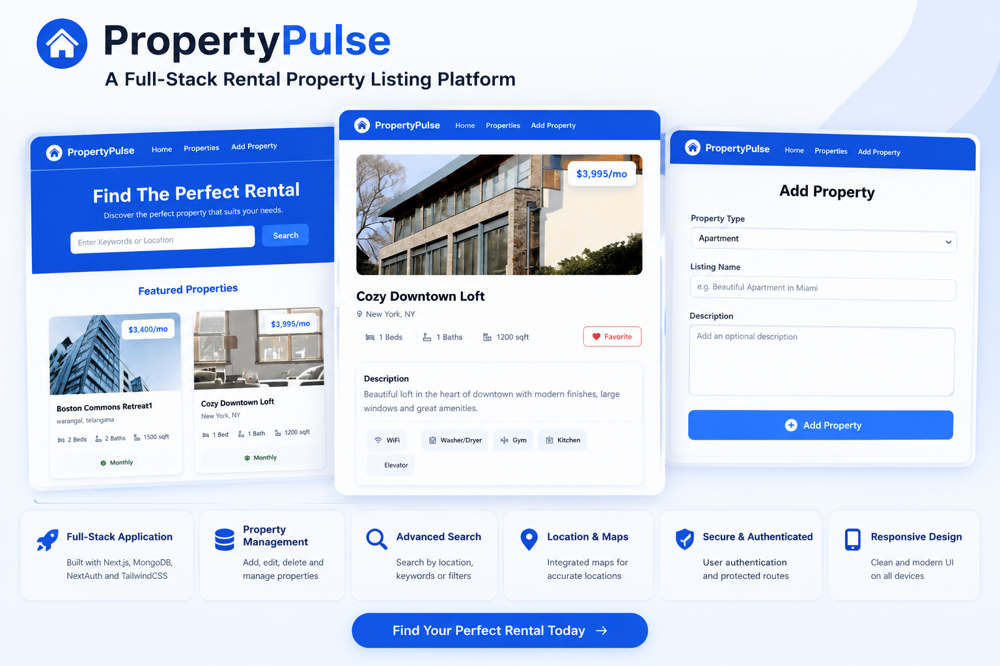
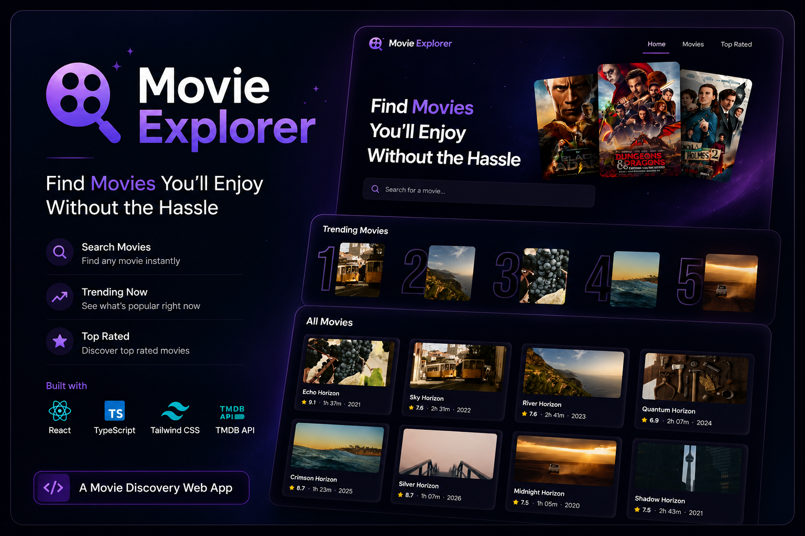
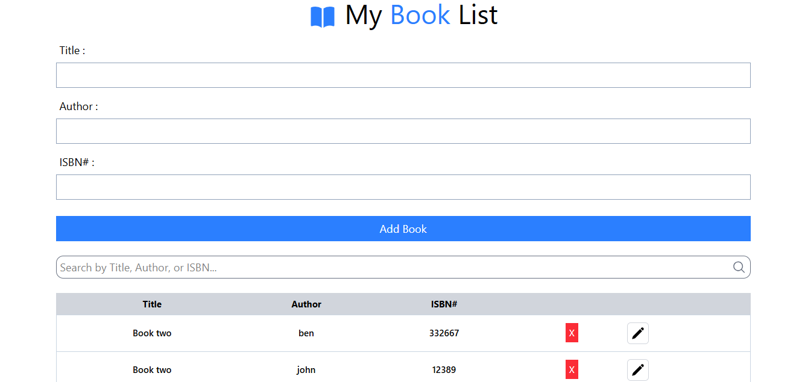

# Sheshu Nalla 👋

**`Aspiring Full-Stack Developer`**

### About Me

I'm a **2025 CSE graduate** focused on building practical web applications and strengthening my problem-solving skills through **DSA and LeetCode**.

I enjoy turning ideas into working products, learning how things work under the hood, and continuously improving as a developer.

- 🔭 Currently building and improving full-stack projects
- 🧠 Practicing DSA & problem solving on LeetCode
- 🌱 Learning and improving my full-stack development skills
- 💡 Interested in building practical, user-focused applications

 

&nbsp;

&nbsp;

---

## 🛠️ Tech Stack

### Languages

### Frontend

### Database & Tools

---
## 🚀 Projects — Showcase

<table>
<tr>

<td width="33%" align="center">

<h3>🏠 Property Pulse</h3>

A property rental platform for exploring and managing property listings through a clean and responsive interface.

<a href="YOUR_PROPERTY_PULSE_REPO">🔗 Repo</a>
&nbsp;•&nbsp;
<a href="YOUR_PROPERTY_PULSE_DEMO">🌐 Live Demo</a>

React · JavaScript · MongoDB · Tailwind CSS

</td>

<td width="33%" align="center">

<h3>🎬 Movie Explorer</h3>

A movie discovery application for searching and exploring movies through a clean and responsive user interface.

<a href="YOUR_MOVIE_EXPLORER_REPO">🔗 Repo</a>
&nbsp;•&nbsp;
<a href="YOUR_MOVIE_EXPLORER_DEMO">🌐 Live Demo</a>

React · JavaScript · Tailwind CSS

</td>

<td width="33%" align="center">

<h3>📚 BookList</h3>

A book management application built to practice CRUD operations and interactive frontend workflows.

<a href="YOUR_BOOKLIST_REPO">🔗 Repo</a>
&nbsp;•&nbsp;
<a href="YOUR_BOOKLIST_DEMO">🌐 Live Demo</a>

React · JavaScript

</td>

</tr>
</table>

## 🧠 Problem Solving

Currently focused on improving my **DSA and problem-solving skills** through consistent LeetCode practice.

I'm working on understanding **reusable problem-solving patterns** rather than simply solving problems individually.

**Current focus:**

`Arrays` · `Hashing` · `Two Pointers` · `Sliding Window` · `Binary Search` · `Stack` · `Linked List` · `Trees` · `Graphs`

---

## 🎯 What I'm Working Toward

I'm working toward becoming a strong **full-stack developer** by:

- Building practical and meaningful applications
- Strengthening DSA and problem-solving fundamentals
- Deepening my understanding of frontend and backend development
- Learning through hands-on projects
- Writing cleaner and more maintainable code

---

## 🤝 Let's Connect

&nbsp;

&nbsp;

&nbsp;

&nbsp;

---

⭐ Thanks for visiting my profile!
